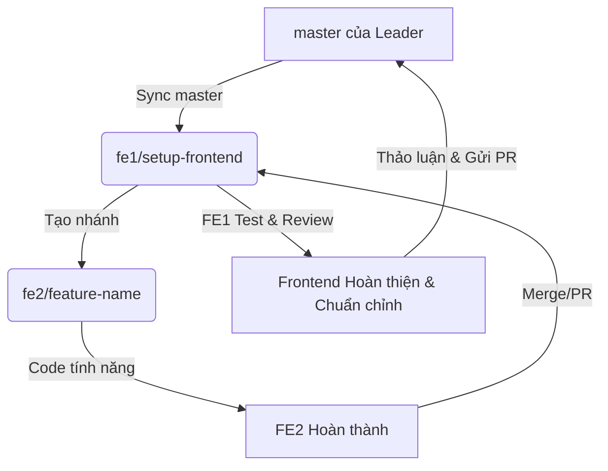

# SIU Collective Frontend

Phân hệ Frontend dành cho **Hệ thống Tìm kiếm Đa phương tiện SIU Collective (SIU Collective Retrieval System)**. Phân hệ này cung cấp giao diện Web UI hiện đại giúp tìm kiếm, theo dõi sự kiện trên dòng thời gian và truy vấn OCR từ các video dựa trên 3 phương thức: Known-Item Search (KIS), Temporal Tracking (Trake), và Visual Q&A (Q&A).

## Tech Stack
- **Framework**: React 19
- **Build Tooling**: Vite 6 & TypeScript
- **Styling**: Tailwind CSS v4 (tích hợp qua trình biên dịch `@tailwindcss/vite`)
- **Icons**: Lucide React
- **Class Utilities**: `clsx` & `tailwind-merge` (`cn()`)

---

## Hướng dẫn phát triển cục bộ dành cho FE1 và FE2 (Local Development Guide)

Tài liệu này hướng dẫn chi tiết cách thiết lập, chạy thử và tuân thủ quy trình Git giữa Frontend Engineer 1 (FE1) và Frontend Engineer 2 (FE2) để đảm bảo đồng bộ hóa mã nguồn.

### 1. Điều kiện cần có trước khi chạy (Prerequisites)
Hãy chắc chắn máy tính của bạn đã cài đặt các công cụ sau:
- **Node.js**: Phiên bản `v20.x` trở lên (Khuyến nghị bản LTS).
- **npm**: Phiên bản `v10.x` trở lên.
- **Git**: Đã cấu hình trên máy tính.
- **IDE**: Khuyến nghị dùng **Visual Studio Code (VS Code)**.
- **Terminal**: Sử dụng PowerShell (trên Windows) hoặc Bash/Zsh (trên Linux/macOS) tại đúng thư mục của dự án.

---

### 2. Quy trình làm việc Git dành cho FE1 và FE2 (Git Workflow)

Để tránh xung đột và giữ lịch sử Git sạch sẽ, quy trình phối hợp được quy định như sau:



#### A. Đối với FE2 (Frontend Engineer 2):
1. **Lấy code mới nhất từ nhánh của FE1**:
   Trước khi bắt đầu làm tính năng mới, hãy checkout về nhánh của FE1 và pull code mới nhất:
   ```bash
   git checkout fe1/setup-frontend
   git pull origin fe1/setup-frontend
   ```
2. **Tạo nhánh riêng để làm việc**:
   Từ nhánh `fe1/setup-frontend`, hãy tạo nhánh riêng của bạn:
   ```bash
   git checkout -b fe2/<ten-tinh-nang>
   # Ví dụ: git checkout -b fe2/search-results-styling
   ```
3. **Đồng bộ code từ FE1 (khi có cập nhật)**:
   Trong quá trình code, nếu FE1 có cập nhật trên nhánh `fe1/setup-frontend`, hãy gộp nó vào nhánh của bạn:
   ```bash
   git fetch origin
   git merge origin/fe1/setup-frontend
   ```
4. **Merge về nhánh FE1 khi hoàn thành**:
   Khi tính năng đã chạy tốt và test không lỗi, hãy push nhánh của bạn lên GitHub và mở Pull Request (PR) trỏ vào nhánh `fe1/setup-frontend` (hoặc báo FE1 để merge trực tiếp).

#### B. Đối với FE1 (NDuyPhuc - FE Lead):
1. **Review & Merge**: Nhận mã nguồn từ các nhánh `fe2/*`, tiến hành review và gộp vào nhánh chính của frontend `fe1/setup-frontend`.
2. **Đồng bộ hóa với Master**:
   Khi nhánh `master` của Leader có cập nhật mới (về backend API hoặc model), FE1 thực hiện đồng bộ nhánh frontend cục bộ:
   ```bash
   git checkout fe1/setup-frontend
   git fetch origin
   git merge origin/master --allow-unrelated-histories
   ```
3. **Mở PR vào master**:
   Khi toàn bộ frontend hoạt động tốt, giao diện chuẩn chỉnh và đã trao đổi ổn định với Leader, FE1 sẽ tiến hành gửi PR từ nhánh `fe1/setup-frontend` vào nhánh `master` để tích hợp vào hệ thống chung.

---

### 3. Cài đặt và Khởi chạy

Các bước thực hiện trong thư mục dự án:

```bash
# 1. Đi vào thư mục frontend
cd frontend

# 2. Cài đặt các package dependencies
npm install

# 3. Chạy dev server cục bộ
npm run dev
```
Mặc định, ứng dụng sẽ chạy tại **`http://localhost:5173/`**.

#### Biên dịch thử nghiệm (Production Build)
Trước khi commit, hãy luôn chạy lệnh build để đảm bảo TypeScript không có lỗi compile:
```bash
npm run build
```
Để xem trước bản build production chạy như thế nào:
```bash
npm run preview
```

---

### 4. Hướng dẫn xử lý lỗi phổ biến (Troubleshooting)

- **Lỗi: Thiếu package hoặc import không hoạt động**
  - *Cách xử lý*: Chạy lại `npm install`. Nếu vẫn lỗi, hãy xóa `node_modules` và cài lại:
    ```bash
    rm -rf node_modules package-lock.json && npm install
    ```
- **Lỗi: Lỗi chính sách thực thi Script trên Windows (Execution Policy)**
  - *Triệu chứng*: Gặp lỗi `File ... cannot be loaded because running scripts is disabled...` khi chạy `npm`.
  - *Cách xử lý*: Chạy lệnh thông qua Command Prompt (`cmd.exe /c "npm run dev"`) hoặc chạy PowerShell với quyền bypass:
    ```powershell
    powershell -ExecutionPolicy Bypass -Command "npm run dev"
    ```
- **Lỗi: Cổng 5173 đã bị chiếm dụng**
  - *Cách xử lý*: Vite sẽ tự động tìm cổng thay thế (như 5174). Bạn cũng có thể tắt tiến trình cũ đang chiếm cổng.
- **Lỗi: Alias `@/` không nhận diện được**
  - *Cách xử lý*: Kiểm tra xem bạn đã import đúng kiểu `@/components/ui/Button` chưa. Tránh viết `@/src/...` hoặc các import tương đối xa kiểu `../../src/...`.

---

### 5. Checklist kiểm thử thành công (Verification)

Trước khi xác nhận hoàn thành một task, hãy kiểm tra danh sách này:
- [ ] Lệnh `npm run dev` chạy không lỗi.
- [ ] Trang Web hiển thị đúng Header `SIU Collective Retrieval` và Hero Title `Multimedia Retrieval System`.
- [ ] Chuyển đổi mượt mà giữa các Tab tác vụ (KIS / Trake / Q&A).
- [ ] Nhập từ khóa, nhấn nút **Search** hiển thị loading spinner trong 500-800ms trước khi render kết quả.
- [ ] Nhấp vào một ứng viên kết quả, khung phát video **Scene Inspector** cập nhật chính xác Video ID và Frame Index tương ứng.
- [ ] Chạy `npm run build` thành công, exit code `0`, không có lỗi TypeScript hay cảnh báo CSS.

---

### 6. Ghi chú tích hợp Backend
Hiện tại phân hệ frontend đang sử dụng thư viện **Mock API** tại [mockApi.ts](file:///c:/Users/Phuc/antigravity/SIU-Collective-Frontend-Setup/frontend/src/api/mockApi.ts) do các API của backend đang được thiết kế ở nhánh `master`.

Khi **Issue #5 (API Contract)** hoàn thành, chúng ta sẽ thay thế Mock API bằng các cuộc gọi API thực tế trỏ tới FastAPI backend.
